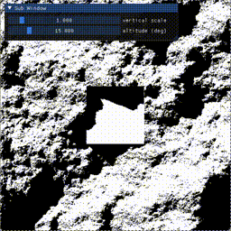

# R2T2: a simple Ray-Tracing Terrain Renderer



This project started from the a desire to make a real-time, realistic,
top-down height map renderer (a.k.a. relief mapper).

It allows the user to render shadows cast by a directional light
onto a height map.

## Installation

```commandline
git clone https://github.com/keepitwiel/r2t2
```

Open the cloned repository in PyCharm, install a virtual environment and install the required packages:

```commandline
pip install -r requirements.txt
```

## Getting started

### Hello World:

```python
import numpy as np
import taichi as ti
from r2t2 import BaseRenderer

# initialize backend framework
ti.init(ti.cpu)

# create height map
mx, my = np.mgrid[-1:1:11j, -1:1:11j]
h = np.sin(mx * np.pi) + np.sin(my * np.pi)

# initialize renderer
renderer = BaseRenderer(h)
renderer.render_internal(
    azimuth=45,  # horizontal direction of Sun, in degrees
    altitude=45,  # angle of Sun over horizon, in degrees
    zoom=1.0,  # camera zoom level
    x_offset=0.0,  # horizontal camera offset from center
    y_offset=0.0,  # vertical camera offset from center
    spp=1,  # samples per pixel
    sun_radius=0.0,  # radius of Sun in degrees
    sun_color=(1.0, 0.9, 0.0),  # Sun color (RGB)
    sky_color=(0.0, 0.0, 1.0),  # Sky color (RGB)
    l_max=np.inf,  # maximum length of rays
    random_xy=True,  # randomize ray spawn point
)

# get image
image = renderer.get_image()  # an 11x11 RGB float32 array
```

### Some included examples
```commandline
python examples/example1.py
```
This example gives you a GUI window where you can play around with
R2T2's parameters.

```commandline
python examples/example2.py
```
A simple example showing framerate (FPS) of a height map based on an image of a raccoon.
On a Macbook Air M3 (2024) with 8GB RAM, the framerate is around 90 FPS in GPU mode.
