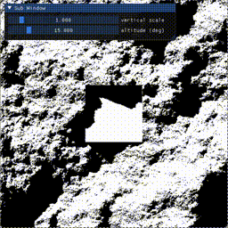

# A simple relief mapper



This project started from the a desire to make a real-time, realistic,
top-down height map renderer (a.k.a. relief mapper).

It allows the user to render shadows cast by a directional light
onto a height map.

## Installation

```commandline
git clone https://github.com/keepitwiel/simple-relief-mapper.git
```

Open the cloned repository in PyCharm, install a virtual environment and install the required packages:

```commandline
pip install -r requirements.txt
```

## Getting started

Run one of the examples:
```commandline
python example1.py
```